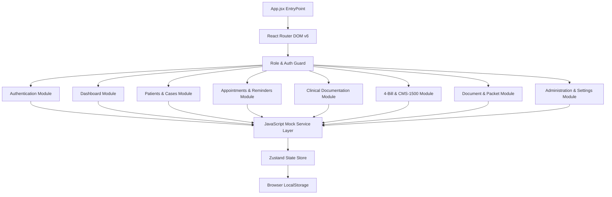
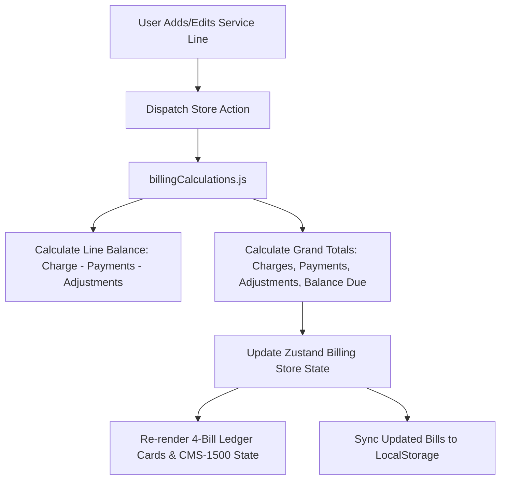
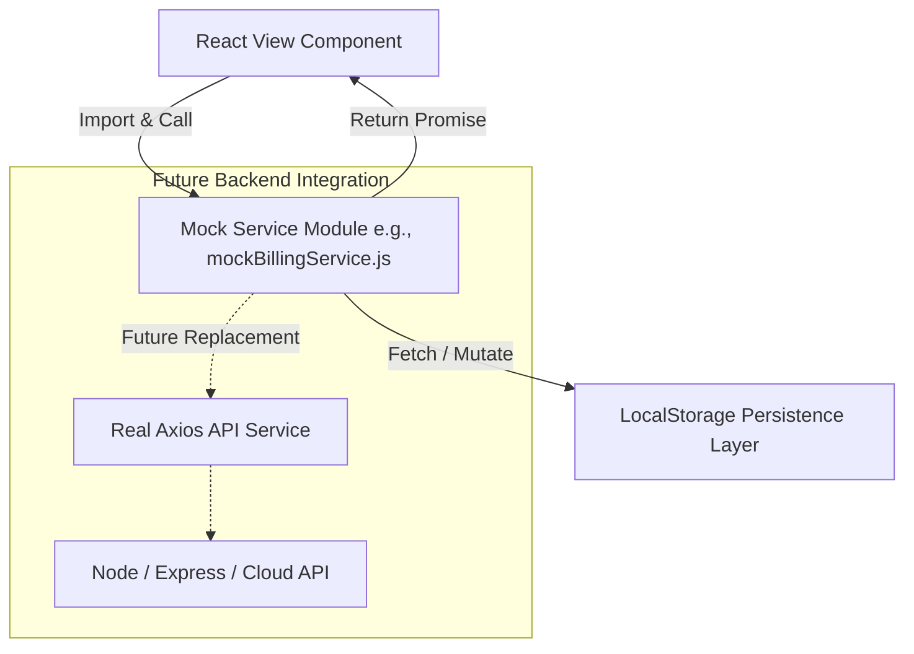

# Frontend Technical Architecture Specification

## Medical Practice Billing & Clinical Documentation Platform

---

## 1. Document Information

| Field | Value |
|---|---|
| Document | Frontend Technical Architecture Specification |
| Version | 0.9.0 |
| Status | Draft — Awaiting Internal Review |
| Current Phase | Phase 1 — Frontend Documentation and Planning |
| Related Documents | `PRD.md`, `wireframe.md`, `flow.md` |
| Approved Frontend Stack | React.js, JavaScript, Tailwind CSS, React Router DOM |
| Backend Status | Not started |
| Database Status | Not started |
| Last Updated | 04 August 2026 |
| Author | Project Team |

---

## 2. Architectural Vision & Scope

This document specifies the frontend technical architecture for the Medical Practice Billing & Clinical Documentation Platform (`MedPractice Pro`).

The architecture is strictly **FRONTEND-ONLY** for Phase 1 and Phase 2. All application features, user interactions, dashboards, clinical forms, 4-provider bill calculators, CMS-1500 previews, and document packet workflows will operate in browser memory and local state using mock services.

### Core Architectural Principles:
1. **Strict Design Preservation:** Preserve existing Google Stitch-exported UI layout, color palettes, typography, spacing, and icons without redesigning existing screens.
2. **Approved Stack Alignment:** Built using **React.js**, **JavaScript (ES6+)**, **Tailwind CSS**, and **React Router DOM**.
3. **Backend-Ready Interface Abstraction:** Decouple all React components from hardcoded data by routing operations through clean JavaScript mock service modules (`src/services/mock/`).
4. **Four-Bill Ledger Engine:** Enable client-side multi-provider billing calculations for JOSMIC Wellness Center, DAV'S Anatomy, ANIK Laser Therapy, and Counselor Practice.
5. **No Real Backend Dependencies:** Zero production backend APIs, database schemas, cloud infrastructure, real auth, real AI APIs, real SMS/email, or real payment gateways in this phase.

---

## 3. Technology Stack & Library Selection

| Layer | Approved Technology | Purpose |
|---|---|---|
| **Core Framework** | React.js (v18+) | Component-based UI rendering |
| **Language** | JavaScript (ES6+ / JSX) | Primary application logic (`.jsx`, `.js`) |
| **Styling Engine** | Tailwind CSS (v3+) | Utility-first styling configured with Stitch design tokens |
| **Routing Engine** | React Router DOM (v6+) | Client-side page routing, nested layouts, role guards |
| **State Management** | Zustand / React Context | Global mock state management & UI toast/modal state |
| **Form Management** | React Hook Form | High-performance form state & input handling |
| **Form Validation** | Zod / Standard JS Validation | Schema-based validation for forms |
| **Icons & Assets** | Lucide React / Material Symbols | Consistent UI icons matching Stitch exports |
| **Date Utilities** | date-fns | Date formatting for clinical notes & appointment scheduling |
| **Mock Storage** | Browser LocalStorage / SessionStorage | Client-side session & fixture data persistence |

---

## 4. Stitch Design Tokens & Preservation Rules

All components must strictly consume design tokens from `clinical_operations_system/DESIGN.md` via Tailwind CSS configuration:

```javascript
// tailwind.config.js
module.exports = {
  content: ["./src/**/*.{js,jsx,html}"],
  theme: {
    extend: {
      colors: {
        'primary': '#031635',             // Deep Navy (Header, Sidebar)
        'secondary': '#0040df',           // Deep Blue Accent
        'secondary-container': '#2d5bff', // Bright Clinical Blue (Primary Buttons, Active Rings)
        'surface': '#f8f9ff',             // Soft Healthcare Surface Background
        'surface-container-lowest': '#ffffff', // Card Container Canvas
        'on-surface': '#0b1c30',          // High-Contrast Primary Text
        'on-surface-variant': '#44474e',  // Muted Label Text
        'error': '#ba1a1a',               // Emergency Red Banner & Errors
        'success': '#10b981',             // Clinical Green Badges
        'warning': '#f59e0b',             // Alert Amber Badges
      },
      fontFamily: {
        sans: ['Inter', 'sans-serif'],
        tabular: ['Inter', 'sans-serif'], // OpenType tabular numerals for financial data
      },
      borderRadius: {
        'sm': '0.25rem',
        'DEFAULT': '0.5rem',  // 8px standard for inputs and buttons
        'lg': '0.75rem',
        'xl': '1rem',         // 16px for cards and modals
      }
    }
  }
};
```

---

## 5. Proposed Directory Structure (JavaScript / React.js)

```text
stitch_medcare_billing_clinical_platform/
├── PRD.md
├── wireframe.md
├── flow.md
├── architecture.md
├── SAMPLE TESTING  ANIK (1).pdf
├── SAMPLE TESTING DAV (1).pdf
├── SAMPLE TESTING JOSMICpdf (1).pdf
└── src/
    ├── assets/
    │   ├── images/
    │   ├── logos/
    │   └── sample-pdfs/
    ├── components/
    │   ├── common/
    │   │   ├── Button.jsx
    │   │   ├── Input.jsx
    │   │   ├── Modal.jsx
    │   │   ├── Toast.jsx
    │   │   ├── Badge.jsx
    │   │   ├── Table.jsx
    │   │   ├── Skeleton.jsx
    │   │   └── ErrorBoundary.jsx
    │   ├── layout/
    │   │   ├── AppLayout.jsx
    │   │   ├── TopHeader.jsx
    │   │   ├── Sidebar.jsx
    │   │   └── RoleGuard.jsx
    │   ├── patients/
    │   │   ├── PatientTable.jsx
    │   │   └── PatientOverviewTab.jsx
    │   ├── cases/
    │   │   ├── CaseCardGrid.jsx
    │   │   ├── AttorneyCard.jsx
    │   │   └── InsuranceCard.jsx
    │   ├── appointments/
    │   │   ├── CalendarGrid.jsx
    │   │   ├── CheckInQueue.jsx
    │   │   └── ReminderStatusTable.jsx
    │   ├── clinical/
    │   │   ├── JosmicPainForm.jsx
    │   │   ├── DavsEswtForm.jsx
    │   │   ├── AnikLaserForm.jsx
    │   │   ├── CounselorFormPlaceholder.jsx
    │   │   ├── AiAssistantPanel.jsx
    │   │   └── SignatureModal.jsx
    │   ├── billing/
    │   │   ├── FourBillOverviewGrid.jsx
    │   │   ├── ServiceLineTable.jsx
    │   │   ├── PaymentModal.jsx
    │   │   ├── AdjustmentModal.jsx
    │   │   └── AgingSummaryTable.jsx
    │   ├── cms/
    │   │   ├── Cms1500FormEditor.jsx
    │   │   └── Cms1500RedGridPreview.jsx
    │   └── documents/
    │       ├── DocumentTable.jsx
    │       ├── PacketBuilderTree.jsx
    │       └── PDFViewerModal.jsx
    ├── constants/
    │   ├── providerConfigs.js
    │   ├── rolePermissions.js
    │   ├── cptCodes.js
    │   └── icd10Codes.js
    ├── hooks/
    │   ├── useAuth.js
    │   ├── usePatients.js
    │   └── useBilling.js
    ├── pages/
    │   ├── auth/
    │   │   ├── LoginPage.jsx
    │   │   ├── ForgotPasswordPage.jsx
    │   │   ├── ResetPasswordPage.jsx
    │   │   ├── MfaVerifyPage.jsx
    │   │   └── PermissionDeniedPage.jsx
    │   ├── dashboards/
    │   │   ├── SuperAdminDashboard.jsx
    │   │   ├── ClinicAdminDashboard.jsx
    │   │   ├── ReceptionistDashboard.jsx
    │   │   ├── DoctorDashboard.jsx
    │   │   ├── TherapistDashboard.jsx
    │   │   ├── CounselorDashboard.jsx
    │   │   └── BillingStaffDashboard.jsx
    │   ├── patients/
    │   ├── cases/
    │   ├── appointments/
    │   ├── clinical/
    │   ├── billing/
    │   ├── cms/
    │   ├── documents/
    │   └── admin/
    ├── routes/
    │   ├── AppRoutes.jsx
    │   └── ProtectedRoute.jsx
    ├── services/
    │   └── mock/
    │       ├── mockAuthService.js
    │       ├── mockPatientService.js
    │       ├── mockCaseService.js
    │       ├── mockAppointmentService.js
    │       ├── mockReminderService.js
    │       ├── mockClinicalNoteService.js
    │       ├── mockBillingService.js
    │       ├── mockCmsClaimService.js
    │       ├── mockDocumentService.js
    │       ├── mockStaffService.js
    │       └── mockAuditService.js
    ├── store/
    │   ├── authStore.js
    │   ├── patientStore.js
    │   ├── billingStore.js
    │   ├── clinicalStore.js
    │   └── uiStore.js
    ├── utils/
    │   ├── billingCalculations.js
    │   ├── cmsMapper.js
    │   └── formatters.js
    └── App.jsx
```

---

## 6. System Architecture Diagrams

### 6.1 Frontend Module Structure



### 6.2 Route Hierarchy Architecture

```mermaid
graph TD
    Root[/ Root] --> Login[/login]
    Root --> Forgot[/forgot-password]
    Root --> Reset[/reset-password]
    Root --> MFA[/mfa-verify]
    Root --> Denied[/403 Permission Denied]

    Root --> AppLayout[AppLayout - Main Shell]
    
    AppLayout --> Dashboards[/dashboard/:role]
    AppLayout --> Patients[/patients]
    Patients --> PatientProfile[/patients/:id/profile]
    AppLayout --> Cases[/cases]
    Cases --> CaseDetails[/cases/:id]
    
    AppLayout --> Appointments[/appointments]
    Appointments --> Calendar[/appointments/calendar]
    Appointments --> CheckIn[/appointments/checkin]
    
    AppLayout --> Clinical[/clinical-notes]
    Clinical --> JosmicForm[/clinical-notes/josmic-pain]
    Clinical --> DavsForm[/clinical-notes/davs-eswt]
    Clinical --> AnikForm[/clinical-notes/anik-laser]
    Clinical --> CounselorForm[/clinical-notes/counselor-session]
    Clinical --> AiAssistant[/clinical-notes/ai-assistant]
    
    AppLayout --> Billing[/billing]
    Billing --> FourBills[/billing/four-bills]
    Billing --> BillCreate[/billing/create]
    Billing --> Aging[/billing/aging]
    
    AppLayout --> CMS[/cms-1500]
    CMS --> CmsEditor[/cms-1500/:id/edit]
    CMS --> CmsPreview[/cms-1500/:id/preview]
    
    AppLayout --> Documents[/documents]
    Documents --> PacketBuilder[/documents/packet-builder]
    
    AppLayout --> Admin[/admin]
    Admin --> Staff[/admin/staff]
    Admin --> Providers[/admin/providers]
    Admin --> Audit[/admin/audit-logs]
```

### 6.3 State Flow & Financial Ledger Calculation Engine



### 6.4 Mock Service Layer Architecture (JavaScript)



---

## 7. Provider Configuration Data Model (`providerConfig.js`)

To prevent hardcoding billing credentials and support future providers (including the Counselor Practice), all provider definitions are managed dynamically via a JavaScript configuration schema:

```javascript
// src/constants/providerConfigs.js

export const INITIAL_PROVIDER_CONFIGS = {
  josmic: {
    id: 'prov-josmic',
    name: 'JOSMIC Wellness Center',
    businessName: 'JOSMIC Wellness Center LLC',
    serviceCategory: 'Pain Management Consultation',
    status: 'ACTIVE',
    isPlaceholder: false,
    address: {
      street: '10101 Harwin Dr.',
      suite: 'Suite 274',
      city: 'Houston',
      state: 'TX',
      zipCode: '77036'
    },
    contact: {
      phone: '713-485-5712',
      fax: '832-416-1502',
      email: 'contact@josmicwellness.com'
    },
    identifiers: {
      taxId: '993723387',
      npi: 'R7637',
      ssnOrEin: 'EIN'
    },
    renderingProvider: {
      name: 'Adeoye, Segun',
      credentials: 'DC / MD',
      npi: 'R7637'
    },
    availableServices: [
      { code: '99204', description: 'Pain Consult', defaultCharge: 1214.00, category: 'Consultation' }
    ],
    availableDiagnoses: [
      { code: 'S13.4', description: 'Cervical sprain/strain' },
      { code: 'S23.3', description: 'Thoracic sprain/strain' },
      { code: 'S33.5', description: 'Lumbar strain' },
      { code: 'M79.1', description: 'Myofascial pain syndrome' },
      { code: 'M54.6', description: 'Pain in thoracic spine' },
      { code: 'M54.50', description: 'Low back pain, unspecified' }
    ]
  },
  davs: {
    id: 'prov-davs',
    name: "DAV'S Anatomy",
    businessName: "DAV'S Anatomy Shockwave Therapy LLC",
    serviceCategory: 'Shockwave Therapy (ESWT)',
    status: 'ACTIVE',
    isPlaceholder: false,
    address: {
      street: '10101 Harwin Dr.',
      suite: 'Suite 320',
      city: 'Houston',
      state: 'TX',
      zipCode: '77036'
    },
    contact: {
      phone: '713-485-0208',
      cell: '832-815-0959',
      fax: '832-416-1502',
      email: 'Davsanatomy@gmail.com'
    },
    identifiers: {
      taxId: '883049745',
      npi: 'R7637',
      ssnOrEin: 'EIN'
    },
    renderingProvider: {
      name: 'Adeoye, Segun',
      credentials: 'DC',
      npi: 'R7637'
    },
    availableServices: [
      { code: '99204', description: 'Initial Visit II', defaultCharge: 250.00, category: 'Evaluation' },
      { code: '0101T', description: 'Shockwave / ESWT', defaultCharge: 1000.00, category: 'Therapy' },
      { code: '10001', description: 'Eye protective glasses', defaultCharge: 50.00, category: 'Supplies' },
      { code: '97124', description: 'Massage Therapy I', defaultCharge: 90.00, category: 'Therapy' },
      { code: '99214', description: 'Final Visit II', defaultCharge: 200.00, category: 'Evaluation' }
    ]
  },
  anik: {
    id: 'prov-anik',
    name: 'ANIK Laser Therapy',
    businessName: 'ANIK Laser Therapy LLC',
    serviceCategory: 'Laser Therapy',
    status: 'ACTIVE',
    isPlaceholder: false,
    address: {
      street: '10101 Harwin Dr.',
      suite: 'Suite 274',
      city: 'Houston',
      state: 'TX',
      zipCode: '77036'
    },
    contact: {
      phone: '713-485-5712',
      cell: '832-815-0959',
      fax: '832-416-1502',
      email: 'Aniklasertherapy@gmail.com'
    },
    identifiers: {
      taxId: '993723387',
      npi: 'R7637',
      ssnOrEin: 'EIN'
    },
    renderingProvider: {
      name: 'Adeoye, Segun',
      credentials: 'DC',
      npi: 'R7637'
    },
    availableServices: [
      { code: '97039', description: 'Laser Therapy', defaultCharge: 2000.00, category: 'Therapy' },
      { code: '10001', description: 'Eye protective glasses', defaultCharge: 50.00, category: 'Supplies' },
      { code: '97124', description: 'Massage Therapy I', defaultCharge: 90.00, category: 'Therapy' },
      { code: '99213', description: 'Follow-Up Consultation', defaultCharge: 500.00, category: 'Consultation' }
    ]
  },
  counselor: {
    id: 'prov-counselor',
    name: 'Counselor Practice',
    businessName: 'Counselor Practice (Pending Configuration)',
    serviceCategory: 'Counseling & Mental Health',
    status: 'CONFIGURATION_PENDING',
    isPlaceholder: true, // Placeholder until client provides complete details
    address: { street: 'TBD', suite: 'TBD', city: 'TBD', state: 'TX', zipCode: '77000' },
    contact: { phone: 'TBD', fax: 'TBD', email: 'counselor@tbd.com' },
    identifiers: { taxId: 'TBD', npi: 'TBD', ssnOrEin: 'EIN' },
    renderingProvider: { name: 'Counselor Provider (TBD)', credentials: 'LCSW / LPC', npi: 'TBD' },
    availableServices: [],
    availableDiagnoses: []
  }
};
```

---

## 8. Client-Side Financial Calculation Utilities (`billingCalculations.js`)

Financial arithmetic must enforce fixed decimal rounding (`.toFixed(2)`) to eliminate JavaScript floating-point precision issues:

```javascript
// src/utils/billingCalculations.js

export const calculateLineItemBalance = (item) => {
  const charge = Number(item.charge) || 0;
  const insPay = Number(item.insurancePayment) || 0;
  const patPay = Number(item.patientPayment) || 0;
  const othPay = Number(item.otherPayment) || 0;
  const adj = Number(item.adjustment) || 0;
  
  const balance = charge - (insPay + patPay + othPay + adj);
  return Number(balance.toFixed(2));
};

export const calculateBillLedgerTotals = (serviceLines = []) => {
  let totalCharges = 0;
  let totalInsurancePayments = 0;
  let totalPatientPayments = 0;
  let totalOtherPayments = 0;
  let totalAdjustments = 0;

  serviceLines.forEach(line => {
    totalCharges += Number(line.charge) || 0;
    totalInsurancePayments += Number(line.insurancePayment) || 0;
    totalPatientPayments += Number(line.patientPayment) || 0;
    totalOtherPayments += Number(line.otherPayment) || 0;
    totalAdjustments += Number(line.adjustment) || 0;
  });

  const totalPayments = totalInsurancePayments + totalPatientPayments + totalOtherPayments;
  const balanceDue = totalCharges - (totalPayments + totalAdjustments);

  return {
    totalCharges: Number(totalCharges.toFixed(2)),
    totalInsurancePayments: Number(totalInsurancePayments.toFixed(2)),
    totalPatientPayments: Number(totalPatientPayments.toFixed(2)),
    totalOtherPayments: Number(totalOtherPayments.toFixed(2)),
    totalPayments: Number(totalPayments.toFixed(2)),
    totalAdjustments: Number(totalAdjustments.toFixed(2)),
    balanceDue: Number(balanceDue.toFixed(2))
  };
};
```

---

## 9. CMS-1500 Mapper Engine (`cmsMapper.js`)

Maps patient, accident case, and provider billing state directly into CMS-1500 (08/05) form boxes:

```javascript
// src/utils/cmsMapper.js

export const mapStateToCms1500Boxes = (patient, caseData, providerConfig, bill) => {
  return {
    box1_insuranceType: 'OTHER',
    box1a_insuredId: caseData.insurancePolicyNumber || '000000000',
    box2_patientName: `${patient.lastName}, ${patient.firstName} ${patient.middleName || ''}`,
    box3_dob: patient.dob,
    box3_sex: patient.sex,
    box4_insuredName: `${patient.lastName}, ${patient.firstName}`,
    box5_patientAddress: `${patient.address.street}, ${patient.address.city}, ${patient.address.state} ${patient.address.zipCode}`,
    box10a_employment: 'NO',
    box10b_autoAccident: caseData.accidentType === 'AUTO_ACCIDENT' ? 'YES' : 'NO',
    box10b_state: caseData.accidentState || 'TX',
    box14_injuryDate: caseData.accidentDate,
    box17_referringProvider: caseData.referringProviderName || 'Anthony Nguyen',
    box21_diagnoses: caseData.diagnosisCodes || ['M546', 'M5450'],
    box24_serviceLines: (bill.items || []).slice(0, 6).map(item => ({
      dateFrom: item.dateOfService,
      dateTo: item.dateOfService,
      pos: item.placeOfService || providerConfig.defaultPlaceOfService || '11',
      cpt: item.cptCode,
      diagPointer: item.diagPointer || '12',
      charge: item.charge,
      units: item.units || 1,
      renderingNpi: providerConfig.renderingProvider.npi
    })),
    box25_taxId: providerConfig.identifiers.taxId,
    box28_totalCharge: bill.totals.totalCharges,
    box29_amountPaid: bill.totals.totalPayments,
    box30_balanceDue: bill.totals.balanceDue,
    box31_signature: providerConfig.renderingProvider.name,
    box32_facilityInfo: `${providerConfig.name}, ${providerConfig.address.street}, ${providerConfig.address.city}, ${providerConfig.address.state}`,
    box33_billingProvider: `${providerConfig.businessName}, ${providerConfig.address.street}, ${providerConfig.contact.phone}`
  };
};
```

---

## 10. LocalStorage Persistence & Mock Services

Mock JavaScript services store and retrieve data synchronously using `window.localStorage` namespaces:

- `medpractice_session_user`
- `medpractice_patient_registry`
- `medpractice_cases`
- `medpractice_appointments`
- `medpractice_clinical_notes`
- `medpractice_bills_ledger`
- `medpractice_cms_claims`
- `medpractice_audit_logs`

A developer Toolbar helper (`src/components/common/DevToolbar.jsx`) provides a **Reset Mock Data** action to clear storage and restore pristine reference PDF demo defaults.

---

## 11. Security Limitations & HIPAA-Aligned UI Controls

1. **Frontend Scope Limitation:** Client-side role switchers and local storage are visual demonstration tools. True security and encryption must be enforced by future backend endpoints.
2. **PHI Masking:** Tax IDs and SSNs default to masked state (`XX-XXX1234`) with click-to-reveal toggle buttons.
3. **Audit Log Logger:** Action triggers (view chart, print bill, sign note) append audit events to `mockAuditService`.
4. **Session Idle Timeout:** Idle event listener displays warning modal at 14 minutes and logs user out at 15 minutes.
5. **AI Draft Disclaimer:** Mandatory banner on AI draft interfaces: *"AI-generated content is a draft and must be reviewed and approved by an authorized healthcare provider."*

---

## 12. Technical Risk Mitigation Matrix

| Identified Technical Risk | Severity | Mitigation Strategy |
| :--- | :---: | :--- |
| **Unconfirmed Counselor Specifications** | Medium | Implement Counselor module as a dynamic configuration shell with explicit `TBD` placeholder badges. Avoid hardcoding fake NPIs or rates. |
| **CMS-1500 Canvas Alignment** | Medium | Use a CSS Grid layout overlaying standard red NUCC CMS-1500 background images for 1-to-1 box alignment. |
| **4-Bill State Synchronization** | High | Centralize calculation logic in `billingCalculations.js` and update grand totals automatically upon any line change. |
| **Stitch Token Inconsistency** | Low | Import design tokens directly from `clinical_operations_system/DESIGN.md` into `tailwind.config.js`. |
| **Large Component Bundle** | Low | Implement React code splitting via `React.lazy()` and React Router DOM Suspense boundaries. |

---

*End of Frontend Technical Architecture Specification (architecture.md)*
