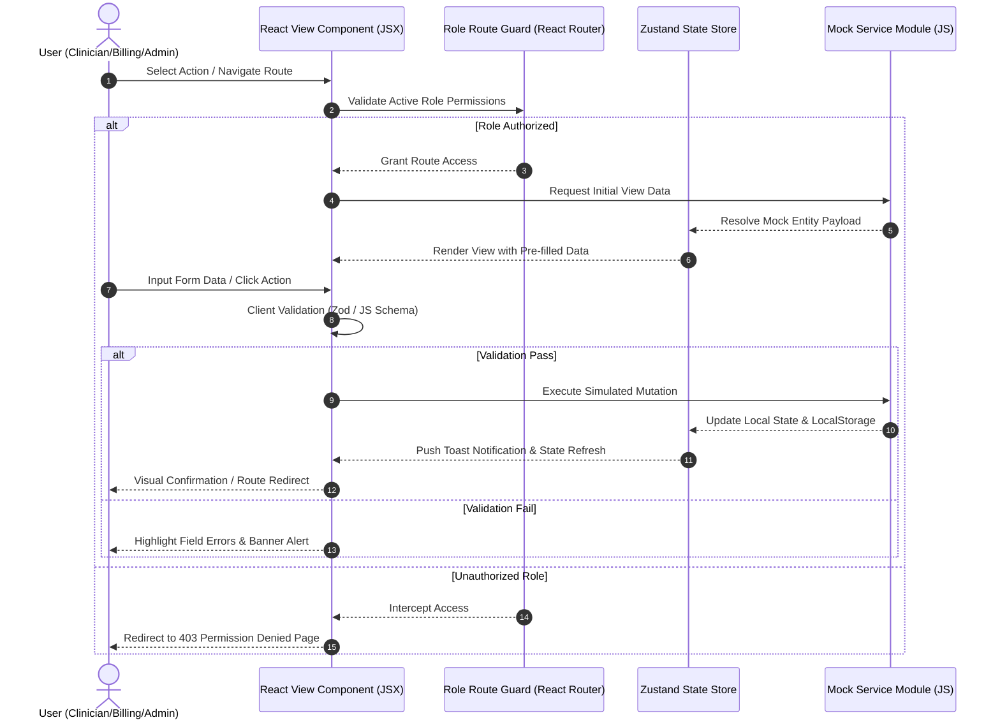

# Frontend User Flow Specifications

## Medical Practice Billing & Clinical Documentation Platform

---

## 1. Document Information

| Field | Value |
|---|---|
| Document | Frontend User Flow Specifications |
| Version | 0.9.0 |
| Status | Draft — Awaiting Internal Review |
| Current Phase | Phase 1 — Frontend Documentation and Planning |
| Related Documents | `PRD.md`, `wireframe.md`, `architecture.md` |
| Approved Frontend Stack | React.js, JavaScript, Tailwind CSS, React Router DOM |
| Backend Status | Not started |
| Database Status | Not started |
| Last Updated | 04 August 2026 |
| Author | Project Team |

---

## 2. Architectural Overview of User Flows

All user flows documented herein are client-side interactive journeys built using **React.js (JavaScript)**, **React Router DOM**, and mock service modules (`src/services/mock/`).

Each flow defines:
1. **Actors:** Authorised user roles.
2. **Entry Screen & Trigger:** Where and how the workflow starts.
3. **Preconditions:** Required initial state.
4. **Steps:** Interactive step-by-step sequence.
5. **Validation:** Client-side Zod / Form validation rules.
6. **Alternate & Error Flows:** Exception handling and secondary user choices.
7. **Success State & Destination:** Visual feedback and route transition.
8. **Mock-Data Change:** Local state and LocalStorage mutations.
9. **Future API Dependency:** Corresponding backend endpoint for future Phase 2 integration.
10. **Status:** Confirmed, Reference-Derived, Assumed, TBD, or Future Backend.

---

## 3. Core User Flow Sequence Diagram

---

## 4. Comprehensive User Flow Specifications (Flows 01 to 37)

---

### Flow 01: Demo Login & Role Redirection
- **Actors:** All Roles / Demo Testers
- **Entry Screen:** Login Screen (`/login`)
- **Trigger:** Clicking a role chip in the Demo Role Drawer or submitting credentials
- **Preconditions:** Unauthenticated browser session
- **Steps:**
  1. User opens `/login`.
  2. User opens "Quick Demo Login" drawer tab.
  3. User selects a demo role (e.g., "Doctor - Dr. Segun").
  4. App populates demo credentials and calls `mockAuthService.login()`.
  5. App stores active session token and user profile in `localStorage`.
  6. App redirects to the role's assigned default dashboard (e.g., `/dashboard/doctor`).
- **Validation:** Credentials match mock directory.
- **Alternate Flow:** Manual email/password submission (`doctor@medpractice.com` / `demo123`).
- **Error Flow:** Invalid password shows red alert banner *"Invalid credentials for demo account"*.
- **Success State:** User logged in; role badge displayed in header; sidebar menu filtered.
- **Navigation Destination:** Assigned Dashboard (`/dashboard/:role`)
- **Mock Data Change:** `activeUser` state updated in `authStore.js`.
- **Future API Dependency:** `POST /api/v1/auth/login`
- **Status:** Confirmed

---

### Flow 02: Forgot Password UI Flow
- **Actors:** All Users
- **Entry Screen:** Login Screen (`/login`)
- **Trigger:** Clicking "Forgot Password?" link
- **Preconditions:** Unauthenticated state
- **Steps:**
  1. User clicks "Forgot Password?".
  2. System navigates to `/forgot-password`.
  3. User enters registered email address and clicks "Send Reset Instructions".
  4. App displays success card: *"Reset instructions sent to your email (Demo Simulation)"*.
  5. User clicks "Return to Login".
- **Validation:** Standard email format validation.
- **Alternate Flow:** User cancels and returns to login.
- **Error Flow:** Empty email displays field error *"Email address is required"*.
- **Success State:** Confirmation card rendered with instructions.
- **Navigation Destination:** `/login`
- **Mock Data Change:** Simulated email log appended to `mockReminderService.js`.
- **Future API Dependency:** `POST /api/v1/auth/forgot-password`
- **Status:** Assumed

---

### Flow 03: MFA Verification UI Flow
- **Actors:** Users with MFA enabled
- **Entry Screen:** MFA Verification Page (`/mfa-verify`)
- **Trigger:** Successful primary login for MFA-required user
- **Preconditions:** Primary credentials validated
- **Steps:**
  1. System redirects user to `/mfa-verify`.
  2. App auto-focuses first digit of 6-digit PIN input box.
  3. User enters PIN code `123456`.
  4. App validates PIN against `mockAuthService.verifyMfa()`.
  5. System unlocks full session and redirects to dashboard.
- **Validation:** 6-Digit numeric PIN required.
- **Alternate Flow:** User clicks "Resend Code via SMS" (triggers 30s timer).
- **Error Flow:** Wrong PIN displays *"Invalid verification code. Please enter 123456 for demo"*.
- **Success State:** Full session token set; redirect to dashboard.
- **Navigation Destination:** Assigned Role Dashboard
- **Mock Data Change:** `isMfaVerified` set to `true`.
- **Future API Dependency:** `POST /api/v1/auth/mfa/verify`
- **Status:** Assumed

---

### Flow 04: Patient Creation Flow
- **Actors:** Super Admin, Clinic Admin, Receptionist
- **Entry Screen:** Patient List (`/patients`)
- **Trigger:** Clicking "+ Register New Patient" button
- **Preconditions:** User has patient registration permission
- **Steps:**
  1. User clicks "+ Register New Patient".
  2. System opens `/patients/new` form.
  3. User fills Demographics (Name, DOB, Sex, Address, Contact, Preferences).
  4. User assigns default providers (JOSMIC, DAV'S, ANIK, Counselor).
  5. User clicks "Save & Register Patient".
  6. Form validates fields; app calls `mockPatientService.createPatient()`.
  7. Success toast appears; user redirected to new Patient Profile.
- **Validation:** Name, DOB, Phone, and at least 1 assigned provider required.
- **Alternate Flow:** Clicking "Save & Add Case" navigates directly to Case Creation.
- **Error Flow:** Missing DOB displays red field outline and error summary banner.
- **Success State:** Toast *"Patient registered successfully"*; profile loaded.
- **Navigation Destination:** `/patients/:id/profile`
- **Mock Data Change:** New patient record appended to `mockPatientService.js` local storage.
- **Future API Dependency:** `POST /api/v1/patients`
- **Status:** Confirmed

---

### Flow 05: Patient Editing Flow
- **Actors:** Super Admin, Clinic Admin, Receptionist
- **Entry Screen:** Patient Profile (`/patients/:id/profile`)
- **Trigger:** Clicking "Edit Demographics" button
- **Preconditions:** Active patient profile selected
- **Steps:**
  1. User clicks "Edit Demographics".
  2. System opens `/patients/:id/edit` pre-filled with data.
  3. User updates phone number and address.
  4. User clicks "Save Changes".
  5. App invokes `mockPatientService.updatePatient()`.
  6. Success toast appears; profile reloads with updated values.
- **Validation:** Required fields must remain non-empty.
- **Alternate Flow:** Clicking "Cancel" prompts unsaved changes confirmation if modified.
- **Error Flow:** Invalid email format blocks submit.
- **Success State:** Updated details rendered on profile.
- **Navigation Destination:** `/patients/:id/profile`
- **Mock Data Change:** Patient entry updated in `mockPatientService.js`.
- **Future API Dependency:** `PUT /api/v1/patients/:id`
- **Status:** Confirmed

---

### Flow 06: Case Creation Flow
- **Actors:** Super Admin, Clinic Admin, Receptionist
- **Entry Screen:** Patient Profile (`/patients/:id/profile`) or Case List (`/cases`)
- **Trigger:** Clicking "+ New Accident Case" button
- **Preconditions:** Patient selected
- **Steps:**
  1. User clicks "+ New Accident Case".
  2. System opens Case Creation Form (`/cases/new`).
  3. User selects Injury Mechanism (MVA, Slip & Fall, Workplace).
  4. User enters Date of Accident and Attorney / Law Firm details.
  5. User assigns 4 Provider profiles (JOSMIC, DAV'S, ANIK, Counselor).
  6. User clicks "Create Case".
  7. App calls `mockCaseService.createCase()`.
  8. Success toast appears; 4-Bill ledger initialized.
- **Validation:** Accident Date and Attorney Name required.
- **Alternate Flow:** Quick-create modal from patient profile tab.
- **Error Flow:** Future accident date selected triggers error *"Accident date cannot be in the future"*.
- **Success State:** Case created with unique ID (e.g., `CASE-2026-089`).
- **Navigation Destination:** `/cases/:id`
- **Mock Data Change:** New case record and 4 initialized bill cards created in state.
- **Future API Dependency:** `POST /api/v1/cases`
- **Status:** Reference-Derived

---

### Flow 07: Assign-Provider Flow
- **Actors:** Super Admin, Clinic Admin
- **Entry Screen:** Case Details (`/cases/:id`)
- **Trigger:** Clicking "Manage Assigned Providers" button
- **Preconditions:** Active case view
- **Steps:**
  1. User clicks "Manage Assigned Providers".
  2. System displays Assigned Providers Modal.
  3. User checks/unchecks provider checkboxes (JOSMIC, DAV'S, ANIK, Counselor).
  4. User clicks "Update Assignments".
  5. App calls `mockCaseService.updateAssignedProviders()`.
  6. Bill overview updates dynamically to show/hide bill cards based on active status.
- **Validation:** At least 1 provider must remain assigned.
- **Alternate Flow:** Toggle provider status between Active and Inactive.
- **Error Flow:** Unchecking all providers displays error *"At least one provider must be assigned to case"*.
- **Success State:** Modal closes; bill overview updates.
- **Navigation Destination:** `/cases/:id`
- **Mock Data Change:** Case `assignedProviderIds` array updated in `mockCaseService.js`.
- **Future API Dependency:** `PUT /api/v1/cases/:id/providers`
- **Status:** Confirmed

---

### Flow 08: Appointment Booking Flow
- **Actors:** Super Admin, Clinic Admin, Receptionist, Clinicians
- **Entry Screen:** Appointment Calendar (`/appointments/calendar`) or Patient Profile
- **Trigger:** Clicking "Book Appointment" or clicking an open slot on calendar
- **Preconditions:** Patient and Case exist
- **Steps:**
  1. User opens Schedule Appointment (`/appointments/new`).
  2. User selects Patient, Case, and Provider (e.g., "DAV'S Anatomy").
  3. User selects Visit Type (e.g., "ESWT Session 1") and Date/Time slot.
  4. User checks "Send 24h SMS Reminder" checkbox.
  5. User clicks "Confirm Booking".
  6. App validates time slot against `mockAppointmentService.js`.
  7. Success modal appears; appointment rendered on calendar.
- **Validation:** No overlapping appointment for selected provider/room.
- **Alternate Flow:** Quick-book from patient profile.
- **Error Flow:** Time conflict displays error banner *"Provider already booked at 10:00 AM"*.
- **Success State:** Appointment saved with status `SCHEDULED`.
- **Navigation Destination:** `/appointments/calendar`
- **Mock Data Change:** Appointment added to `mockAppointmentService.js`.
- **Future API Dependency:** `POST /api/v1/appointments`
- **Status:** Confirmed

---

### Flow 09: Appointment Rescheduling Flow
- **Actors:** Super Admin, Clinic Admin, Receptionist
- **Entry Screen:** Appointment Details Modal (`/appointments/:id`)
- **Trigger:** Clicking "Reschedule" button
- **Preconditions:** Existing appointment in `SCHEDULED` status
- **Steps:**
  1. User opens Appointment Details modal.
  2. User clicks "Reschedule".
  3. System opens Reschedule Modal with date/time picker.
  4. User selects new date/time and enters reason *"Patient requested date change"*.
  5. User clicks "Update Schedule".
  6. App updates appointment object; triggers simulated reschedule notification.
- **Validation:** New time slot must be available.
- **Alternate Flow:** Drag-and-drop appointment card to new time slot on calendar.
- **Error Flow:** Past date selection blocked.
- **Success State:** Appointment updated; status badge displays `RESCHEDULED`.
- **Navigation Destination:** `/appointments/calendar`
- **Mock Data Change:** Appointment `startTime` and `endTime` updated in state.
- **Future API Dependency:** `PUT /api/v1/appointments/:id/reschedule`
- **Status:** Confirmed

---

### Flow 10: Appointment Cancellation Flow
- **Actors:** Super Admin, Clinic Admin, Receptionist
- **Entry Screen:** Appointment Details Modal (`/appointments/:id`)
- **Trigger:** Clicking "Cancel Appointment" button
- **Preconditions:** Appointment exists
- **Steps:**
  1. User opens Appointment Details modal.
  2. User clicks "Cancel Appointment".
  3. System displays Cancel Confirmation Dialog.
  4. User selects reason (e.g., "Patient Cancellation") and inputs notes.
  5. User clicks "Confirm Cancellation".
  6. App calls `mockAppointmentService.cancelAppointment()`.
  7. Status changes to `CANCELLED`; slot freed on calendar.
- **Validation:** Reason selection mandatory.
- **Alternate Flow:** Mark as "No-Show" instead of cancelled.
- **Error Flow:** Submitting without reason highlights radio options.
- **Success State:** Gray status badge `CANCELLED` displayed.
- **Navigation Destination:** `/appointments/calendar`
- **Mock Data Change:** Appointment status updated; slot cleared.
- **Future API Dependency:** `DELETE /api/v1/appointments/:id`
- **Status:** Confirmed

---

### Flow 11: Reminder Configuration Flow
- **Actors:** Super Admin, Clinic Admin, Receptionist
- **Entry Screen:** Reminder Settings (`/settings/reminders`)
- **Trigger:** Modifying reminder rules or template text
- **Preconditions:** Admin access
- **Steps:**
  1. User navigates to `/settings/reminders`.
  2. User toggles "Enable 24-Hour SMS Reminder" to ON.
  3. User edits SMS message template avoiding sensitive PHI details.
  4. User clicks "Save Reminder Configuration".
  5. App updates configuration in `mockReminderService.js`.
- **Validation:** Template text must contain required placeholders (`{PATIENT_NAME}`, `{APT_TIME}`).
- **Alternate Flow:** Reset template to default copy.
- **Error Flow:** Including prohibited diagnosis text triggers compliance warning banner.
- **Success State:** Success toast *"Reminder settings updated"*.
- **Navigation Destination:** `/settings/reminders`
- **Mock Data Change:** `mockReminderSettings` updated in state.
- **Future API Dependency:** `POST /api/v1/reminders/settings`
- **Status:** Confirmed

---

### Flow 12: Reminder-Status Simulation Flow
- **Actors:** Super Admin, Clinic Admin, Receptionist
- **Entry Screen:** Reminder Delivery Status (`/appointments/reminders`)
- **Trigger:** Viewing automated reminder execution logs
- **Preconditions:** Booked appointments exist
- **Steps:**
  1. User opens `/appointments/reminders`.
  2. Table displays sent reminders with status `Sent - Demo`.
  3. User clicks "Simulate Patient Response (Confirm)".
  4. App updates simulated status to `Delivered - Confirmed`.
  5. Appointment calendar updates appointment badge to `CONFIRMED`.
- **Validation:** Read-only log with demo action triggers.
- **Alternate Flow:** Simulate "Patient Reply Reschedule".
- **Error Flow:** Simulating failure sets status to `Failed - Demo`.
- **Success State:** Status badge updates to green `CONFIRMED`.
- **Navigation Destination:** `/appointments/reminders`
- **Mock Data Change:** `mockReminderLogs` and `mockAppointments` updated.
- **Future API Dependency:** `GET /api/v1/reminders/logs`
- **Status:** Confirmed

---

### Flow 13: Patient Check-in Flow
- **Actors:** Super Admin, Clinic Admin, Receptionist
- **Entry Screen:** Front Desk Check-in (`/appointments/checkin`) or Receptionist Dashboard
- **Trigger:** Patient arrives at clinic; staff clicks "Check In"
- **Preconditions:** Scheduled appointment for today
- **Steps:**
  1. User opens `/appointments/checkin`.
  2. User locates arriving patient in today's schedule table.
  3. User clicks green "Check In Patient" button.
  4. App updates appointment status to `CHECKED_IN` (In Waiting Room).
  5. Doctor/Therapist dashboards update in real time to show patient waiting.
- **Validation:** Check-in only allowed for today's visits.
- **Alternate Flow:** One-click arrival toggle from dashboard widget.
- **Error Flow:** Attempting check-in for future date displays warning.
- **Success State:** Green check-in badge rendered; timestamp recorded.
- **Navigation Destination:** `/appointments/checkin`
- **Mock Data Change:** Appointment status updated in state.
- **Future API Dependency:** `PUT /api/v1/appointments/:id/checkin`
- **Status:** Confirmed

---

### Flow 14: JOSMIC Consultation Form Flow
- **Actors:** Doctor, Super Admin, Clinic Admin
- **Entry Screen:** Clinical Notes List (`/clinical-notes`) or Doctor Dashboard
- **Trigger:** Clicking "+ New JOSMIC Pain Consultation Report"
- **Preconditions:** Patient and JOSMIC provider selected
- **Steps:**
  1. User opens JOSMIC Pain Form (`/clinical-notes/josmic-pain`).
  2. Section 1 (Demographics): System pre-fills Patient Name, DOB, Sex.
  3. Section 2 (Chief Complaint): User checks Pain Description (Sharp, Throbbing) and Pain Locations (L.Back, Neck, L.Ankle).
  4. Section 3 (HPI): User selects Mechanism of Injury (MVA), Injury Date, and Pain Scale (Current: 7, Worst: 8, Best: 4).
  5. Section 4 (ROS & Exam): User selects inspection, palpation, and ROM findings.
  6. Section 5 (Diagnosis): User checks ICD-10 codes (S13.4, S23.3, S33.5, M54.50).
  7. Section 6 (Plan): User orders diagnostics and recommends Laser / Shockwave therapy.
  8. User clicks "Save Clinical Note Draft".
  9. App validates entries and saves draft note object.
- **Validation:** Chief Complaint, at least 1 Pain Location, and HPI required.
- **Alternate Flow:** "Save & Launch AI Assistant" to refine narrative text.
- **Error Flow:** Submitting without ICD-10 diagnosis highlights Diagnosis section.
- **Success State:** Draft note saved with status `DRAFT`.
- **Navigation Destination:** `/clinical-notes/:id/preview`
- **Mock Data Change:** New JOSMIC note appended to `mockClinicalNoteService.js`.
- **Future API Dependency:** `POST /api/v1/notes/josmic`
- **Status:** Reference-Derived

---

### Flow 15: DAV'S ESWT Session Flow
- **Actors:** Therapist, Doctor, Super Admin
- **Entry Screen:** Therapist Dashboard (`/dashboard/therapist`)
- **Trigger:** Clicking "Perform ESWT Session" on assigned patient
- **Preconditions:** ESWT initial evaluation completed
- **Steps:**
  1. User opens DAV'S ESWT Form (`/clinical-notes/davs-eswt`).
  2. Form pre-fills Session Number (e.g., Session 1 of 3).
  3. User enters Vitals (BP: 120/80 mmHg, HR: 72 bpm).
  4. User checks Treatment Areas (Low Back, Left Ankle).
  5. User inputs device parameters (Bar: 3.0, Hz: 10 Hz, Dose: 1000x3, Total Waves: 3000).
  6. User toggles BLT Cream Applied: YES (Application Time: 10:15 AM).
  7. User verifies Normal Reaction (No severe bruising).
  8. User inputs post-procedure instructions and clicks "Submit Session Form".
  9. App validates parameters and saves ESWT note.
- **Validation:** Vitals and Bar/Hz settings required within safe bounds.
- **Alternate Flow:** Add additional custom treatment area if needed.
- **Error Flow:** Bar setting > 4.0 displays safety warning limit.
- **Success State:** Session completed; total wave count added to patient record.
- **Navigation Destination:** `/dashboard/therapist`
- **Mock Data Change:** New ESWT session note appended; billable item flagged.
- **Future API Dependency:** `POST /api/v1/notes/davs`
- **Status:** Reference-Derived

---

### Flow 16: ANIK Laser Session Flow
- **Actors:** Therapist, Doctor, Super Admin
- **Entry Screen:** Therapist Dashboard (`/dashboard/therapist`)
- **Trigger:** Clicking "Perform Laser Session"
- **Preconditions:** Laser therapy ordered
- **Steps:**
  1. User opens ANIK Laser Form (`/clinical-notes/anik-laser`).
  2. Form pre-fills Session Number (e.g., Session 2 of 3).
  3. User inputs Vitals (BP: 110/60 mmHg, HR: 85 bpm, Temp: 97.7°F).
  4. User enters Laser Parameters (Wavelength: 800nm, Total Mins: 900s, Dose: 10.5W, Total Energy: 236,250 Joules).
  5. User checks "Procedure Tolerated: YES" and "Duration Completed: YES".
  6. User inputs post-procedure instructions and clicks "Submit Laser Form".
  7. App validates numerical dosage inputs and saves laser note.
- **Validation:** Positive confirmation of consent and duration completion.
- **Alternate Flow:** Log adverse patient reaction note if procedure interrupted.
- **Error Flow:** Missing energy calculation highlights Dose field.
- **Success State:** Laser session recorded; status updated to `COMPLETE`.
- **Navigation Destination:** `/dashboard/therapist`
- **Mock Data Change:** New ANIK laser note saved in `mockClinicalNoteService.js`.
- **Future API Dependency:** `POST /api/v1/notes/anik`
- **Status:** Reference-Derived

---

### Flow 17: Counselor Placeholder Flow
- **Actors:** Counselor, Doctor, Super Admin
- **Entry Screen:** Counselor Dashboard (`/dashboard/counselor`)
- **Trigger:** Clicking "New Counselor Session Note"
- **Preconditions:** Active counselor assignment
- **Steps:**
  1. User opens Counselor Note Form (`/clinical-notes/counselor-session`).
  2. Banner displays: *Counselor Template Configuration Pending — Using Generic Shell*.
  3. User fills generic fields: Session Date, Assessment Summary, Goals Progress, Next Visit Interval.
  4. User clicks "Save Counselor Note".
  5. App saves note object with `isPlaceholder: true` flag.
- **Validation:** Session Date and Summary text required.
- **Alternate Flow:** Mark note as preliminary intake assessment.
- **Error Flow:** Submitting empty text displays validation message.
- **Success State:** Note saved; placeholder badge rendered in list.
- **Navigation Destination:** `/dashboard/counselor`
- **Mock Data Change:** Counselor note appended to `mockClinicalNoteService.js`.
- **Future API Dependency:** `POST /api/v1/notes/counselor`
- **Status:** TBD

---

### Flow 18: Clinical-Note Creation Flow
- **Actors:** Doctor, Therapist, Counselor
- **Entry Screen:** Clinical Notes List (`/clinical-notes`)
- **Trigger:** Clicking "+ Create Clinical Note" button
- **Preconditions:** Patient chart open
- **Steps:**
  1. User clicks "+ Create Clinical Note".
  2. System prompts Provider Template Selection Modal (JOSMIC Pain, DAV'S ESWT, ANIK Laser, Counselor Generic).
  3. User selects template matching active provider context.
  4. App opens corresponding structured form with patient header pre-filled.
- **Validation:** Provider template choice required.
- **Alternate Flow:** Open blank note shell if provider unassigned.
- **Error Flow:** Attempting creation for inactive patient displays error.
- **Success State:** Structured form loaded with correct fields.
- **Navigation Destination:** Selected Note Form Page
- **Mock Data Change:** Temporary draft state initialized in `clinicalStore.js`.
- **Future API Dependency:** `POST /api/v1/notes`
- **Status:** Confirmed

---

### Flow 19: Mock AI Draft Generation Flow
- **Actors:** Doctor, Counselor, Super Admin, Clinic Admin
- **Entry Screen:** AI Note Assistant (`/clinical-notes/ai-assistant`) or Form Sidebar
- **Trigger:** Clicking "Generate AI Draft" prompt preset button
- **Preconditions:** Structured form data or raw patient complaints entered
- **Steps:**
  1. User opens AI Note Assistant tool.
  2. User selects prompt preset (e.g., "Draft HPI from Pain Form Inputs").
  3. User clicks "Generate AI Note Draft".
  4. UI displays loading spinner: *"Generating AI Draft (Demo Simulation)..."*.
  5. App fetches predefined mock response based on selected complaint tags.
  6. AI draft populates in right editor panel with yellow disclaimer banner: *"AI-generated content is a draft and must be reviewed and approved by an authorized healthcare provider."*
  7. User edits generated text and clicks "Transfer to Clinical Note".
- **Validation:** Input tags required before draft generation.
- **Alternate Flow:** Click "Regenerate Section" to swap mock text variant.
- **Error Flow:** Empty inputs prompt user *"Please select at least one chief complaint or pain area"*.
- **Success State:** AI draft transferred into note narrative editor.
- **Navigation Destination:** Clinical Note Editor
- **Mock Data Change:** `aiDraftContent` set in `clinicalStore.js`.
- **Future API Dependency:** `POST /api/v1/ai/generate-note`
- **Status:** Confirmed

---

### Flow 20: Note Review Flow
- **Actors:** Doctor, Clinic Admin, Super Admin
- **Entry Screen:** Doctor Dashboard or Notes List (`/clinical-notes`)
- **Trigger:** Opening a note in `IN_REVIEW` or `DRAFT` status
- **Preconditions:** Note created by therapist or draft submitted
- **Steps:**
  1. User selects note from review queue.
  2. App opens Note Reviewer View (`/clinical-notes/:id/review`).
  3. Reviewer inspects vital signs, procedure settings, and narrative text.
  4. Reviewer adds internal review comments or edits narrative.
  5. Reviewer clicks "Proceed to Approval & Signature".
- **Validation:** Note must be complete with mandatory fields filled.
- **Alternate Flow:** Click "Request Changes" to send note back to author.
- **Error Flow:** Incomplete vitals highlight missing data row.
- **Success State:** Note advances to `APPROVED` stage.
- **Navigation Destination:** Signature Modal
- **Mock Data Change:** Note status updated to `IN_REVIEW`.
- **Future API Dependency:** `PUT /api/v1/notes/:id/review`
- **Status:** Confirmed

---

### Flow 21: Note Approval & Signature Flow
- **Actors:** Doctor, Therapist, Counselor
- **Entry Screen:** Note Reviewer View or Final Form Step
- **Trigger:** Clicking "Approve & Sign Note" button
- **Preconditions:** Note reviewed and authorized user logged in
- **Steps:**
  1. User clicks "Approve & Sign Note".
  2. System opens Signature Modal Overlay.
  3. User selects saved signature image or signs digital canvas.
  4. User enters NPI / License verification pin.
  5. User clicks "Confirm Signature & Lock Chart".
  6. App applies signature watermark; updates note status to `SIGNED` and `LOCKED`.
  7. Note content becomes read-only in the UI.
- **Validation:** Signature graphic and NPI pin mandatory.
- **Alternate Flow:** Clear canvas and redraw signature.
- **Error Flow:** Empty signature pad displays error *"Signature required before locking note"*.
- **Success State:** Green "SIGNED & LOCKED" badge rendered on chart.
- **Navigation Destination:** Finalised Note Preview (`/clinical-notes/:id/preview`)
- **Mock Data Change:** Note `status` set to `LOCKED`, timestamp locked.
- **Future API Dependency:** `POST /api/v1/notes/:id/sign`
- **Status:** Confirmed

---

### Flow 22: Signed-Note Amendment Flow
- **Actors:** Doctor, Clinic Admin, Super Admin
- **Entry Screen:** Finalised Note Preview (`/clinical-notes/:id/preview`)
- **Trigger:** Clicking "Create Addendum / Amend Note" button
- **Preconditions:** Note in `LOCKED` status
- **Steps:**
  1. User opens locked note preview.
  2. User clicks "Create Addendum / Amend Note".
  3. System opens Amendment Screen (`/clinical-notes/:id/amend`).
  4. Original signed text is rendered in read-only container.
  5. User enters Addendum text: *"Correction to injury date based on updated police report"*.
  6. User signs addendum and clicks "Save Stamped Addendum".
  7. App appends timestamped addendum block below original locked note.
- **Validation:** Original note text cannot be edited or deleted.
- **Alternate Flow:** Cancel addendum creation.
- **Error Flow:** Blank addendum submission blocked.
- **Success State:** Addendum appended with timestamp and author signature.
- **Navigation Destination:** `/clinical-notes/:id/preview`
- **Mock Data Change:** Addendum array appended to note object in `mockClinicalNoteService.js`.
- **Future API Dependency:** `POST /api/v1/notes/:id/amendments`
- **Status:** Confirmed

---

### Flow 23: Add Treatment Service to Bill Flow
- **Actors:** Billing Staff, Clinic Admin, Super Admin
- **Entry Screen:** Bill Editor (`/billing/bills/:id/edit`)
- **Trigger:** Clicking "+ Add Service Line" button
- **Preconditions:** Draft or editable bill open
- **Steps:**
  1. User opens Bill Editor.
  2. User clicks "+ Add Service Line".
  3. System opens Add Service Line Modal.
  4. User selects Date of Service and CPT Code (e.g., `0101T` ESWT).
  5. Service description and default fee ($1,000.00) auto-populate.
  6. User adjusts units (e.g., 3 units) and checks Diagnosis Pointer (1, 2).
  7. User clicks "Add Line Item".
  8. Line item appends to table; total charges recalculate instantaneously ($3,000.00) via `billingCalculations.js`.
- **Validation:** Valid CPT code and positive charge amount required.
- **Alternate Flow:** Select custom procedure code and manual price.
- **Error Flow:** Negative charge amount displays error *"Charge must be greater than $0.00"*.
- **Success State:** New line added; ledger totals updated.
- **Navigation Destination:** `/billing/bills/:id/edit`
- **Mock Data Change:** `items` array updated in `mockBillingService.js`.
- **Future API Dependency:** `POST /api/v1/bills/:id/items`
- **Status:** Reference-Derived

---

### Flow 24: Four-Bill Navigation Flow
- **Actors:** Billing Staff, Clinic Admin, Doctor, Counselor, Super Admin
- **Entry Screen:** Patient Profile or Four Bills Overview (`/billing/four-bills`)
- **Trigger:** Clicking provider tabs or bill summary cards
- **Preconditions:** Patient accident case selected
- **Steps:**
  1. User opens `/billing/four-bills`.
  2. Overview displays 4 Provider Cards (JOSMIC, DAV'S, ANIK, Counselor).
  3. User inspects individual balance totals and billing statuses.
  4. User clicks "Open Ledger" on DAV'S Anatomy card.
  5. App filters billing ledger to display DAV'S ESWT service lines ($9,870.00 total).
  6. User clicks "Switch to ANIK Laser Bill" tab at top.
  7. Ledger view switches seamlessly to ANIK Laser service lines ($18,920.00 total).
- **Validation:** Seamless tab switching across all 4 providers.
- **Alternate Flow:** View Counselor card displaying `Configuration Pending` badge.
- **Error Flow:** N/A (Navigation Flow).
- **Success State:** Dynamic bill card filtering active.
- **Navigation Destination:** Selected Provider Ledger (`/billing/bills/:id`)
- **Mock Data Change:** `activeProviderFilter` updated in `billingStore.js`.
- **Future API Dependency:** `GET /api/v1/cases/:id/bills`
- **Status:** Confirmed

---

### Flow 25: Create Bill Flow
- **Actors:** Billing Staff, Clinic Admin, Super Admin
- **Entry Screen:** Four Bills Overview or Create Medical Bill (`/billing/create`)
- **Trigger:** Clicking "+ Create Provider Bill"
- **Preconditions:** Unbilled completed treatment sessions exist
- **Steps:**
  1. User opens `/billing/create`.
  2. User selects Patient, Accident Case, and Target Provider (e.g., "JOSMIC Wellness Center").
  3. App auto-fetches unbilled clinical notes and treatments for selected provider.
  4. User reviews pre-populated service lines (e.g., CPT 99204 — $1,214.00).
  5. User checks statement comments and clicks "Generate Provider Bill".
  6. App creates new bill object in `DRAFT` status and assigns Statement # (`120197`).
- **Validation:** At least 1 service line required.
- **Alternate Flow:** Manual entry of service lines if auto-populate empty.
- **Error Flow:** Attempting bill creation for provider with no services displays error.
- **Success State:** Bill created; Statement preview unlocked.
- **Navigation Destination:** `/billing/bills/:id`
- **Mock Data Change:** New bill added to `mockBillingService.js`.
- **Future API Dependency:** `POST /api/v1/bills`
- **Status:** Confirmed

---

### Flow 26: Add Payment Flow
- **Actors:** Billing Staff, Clinic Admin, Super Admin
- **Entry Screen:** Provider Bill Details (`/billing/bills/:id`)
- **Trigger:** Clicking "Record Payment" button
- **Preconditions:** Outstanding balance on bill
- **Steps:**
  1. User opens Provider Bill Details.
  2. User clicks "Record Payment".
  3. System opens Add Payment Modal.
  4. User selects Payment Source (Insurance Payment / Patient Payment / Attorney LOP).
  5. User enters Amount ($500.00), Date, Check/Ref # (`CHK-88902`), and Notes.
  6. User clicks "Post Payment".
  7. App deducts payment from remaining balance using `billingCalculations.js`.
- **Validation:** Payment amount cannot exceed remaining total balance.
- **Alternate Flow:** Apply payment proportionally across multiple service lines.
- **Error Flow:** Entering payment > balance displays error *"Payment exceeds remaining balance"*.
- **Success State:** Payment recorded in ledger; balance updated.
- **Navigation Destination:** `/billing/bills/:id`
- **Mock Data Change:** Payment entry added to bill `payments` array in state.
- **Future API Dependency:** `POST /api/v1/bills/:id/payments`
- **Status:** Confirmed

---

### Flow 27: Add Adjustment Flow
- **Actors:** Billing Staff, Super Admin
- **Entry Screen:** Provider Bill Details (`/billing/bills/:id`)
- **Trigger:** Clicking "Post Adjustment / Write-Off" button
- **Preconditions:** Active bill ledger view
- **Steps:**
  1. User opens Provider Bill Details.
  2. User clicks "Post Adjustment".
  3. System opens Add Adjustment Modal.
  4. User selects Adjustment Type (Contractual Adjustment / Attorney Fee Discount).
  5. User enters Amount ($214.00) and Reason text.
  6. User clicks "Apply Adjustment".
  7. App subtracts adjustment from balance due via `billingCalculations.js`.
- **Validation:** Adjustment amount $\le$ current remaining balance.
- **Alternate Flow:** Full balance write-off.
- **Error Flow:** Exceeding balance triggers warning.
- **Success State:** Adjustment posted; ledger updated.
- **Navigation Destination:** `/billing/bills/:id`
- **Mock Data Change:** Adjustment entry appended to bill in `mockBillingService.js`.
- **Future API Dependency:** `POST /api/v1/bills/:id/adjustments`
- **Status:** Confirmed

---

### Flow 28: Finalise Demo Bill Flow
- **Actors:** Billing Staff, Super Admin
- **Entry Screen:** Provider Bill Details (`/billing/bills/:id`)
- **Trigger:** Clicking "Finalise & Issue Statement" button
- **Preconditions:** Bill in `DRAFT` or `READY_FOR_REVIEW` status
- **Steps:**
  1. User opens Provider Bill Details.
  2. User clicks "Finalise & Issue Statement".
  3. System displays Finalise Bill Confirmation Dialog.
  4. User reviews total charges, payments, adjustments, and final balance.
  5. User clicks "Confirm Finalisation".
  6. App updates bill status to `FINALISED_DEMO`.
  7. Service lines become read-only; CMS-1500 export button unlocked.
- **Validation:** Confirmation dialog click required.
- **Alternate Flow:** Controlled "Reopen Demo Bill" action with reason modal for authorized admins.
- **Error Flow:** Finalising bill with zero service lines blocked.
- **Success State:** Badge updates to blue `FINALISED - DEMO`; editing locked.
- **Navigation Destination:** `/billing/bills/:id`
- **Mock Data Change:** Bill `status` set to `FINALISED_DEMO`.
- **Future API Dependency:** `PUT /api/v1/bills/:id/finalise`
- **Status:** Confirmed

---

### Flow 29: CMS-1500 Editor & Preview Flow
- **Actors:** Billing Staff, Clinic Admin, Super Admin
- **Entry Screen:** Provider Bill Details (`/billing/bills/:id`) or Claim List (`/cms-1500`)
- **Trigger:** Clicking "Generate CMS-1500 Claim Preview"
- **Preconditions:** Finalised or reviewed provider bill
- **Steps:**
  1. User clicks "Generate CMS-1500 Claim Preview".
  2. App opens CMS-1500 Visual Editor (`/cms-1500/:id/edit`).
  3. System auto-populates Boxes 1-33 using `cmsMapper.js`.
  4. User verifies Insured ID (Box 1a), Diagnosis Pointers (Box 21/24E), Tax ID (Box 25), and NPI (Box 32a/33a).
  5. User clicks "Switch to Visual Red-Claim Preview" tab.
  6. App renders red-grid canvas matching NUCC CMS-1500 (08/05) claim standards.
  7. User clicks "Download Demo Claim PDF".
- **Validation:** Boxes 1a, 21, 24, 25, 32, 33 required.
- **Alternate Flow:** Edit diagnosis pointer numbers inline on CMS-1500 form editor.
- **Error Flow:** Missing rendering NPI displays red compliance highlight on Box 24J.
- **Success State:** Red-grid preview displayed with status `GENERATED_DEMO`.
- **Navigation Destination:** `/cms-1500/:id/preview`
- **Mock Data Change:** CMS-1500 claim record created in `mockCmsClaimService.js`.
- **Future API Dependency:** `POST /api/v1/claims/cms1500`
- **Status:** Reference-Derived

---

### Flow 30: Document Preview Flow
- **Actors:** All Roles
- **Entry Screen:** Document Management (`/documents`) or Patient Chart
- **Trigger:** Clicking "View Document" icon on any file row
- **Preconditions:** Document attachment exists
- **Steps:**
  1. User clicks "View Document".
  2. System opens Document Preview Modal.
  3. App renders sample PDF/Image document preview (e.g., JOSMIC Cover Page PDF).
  4. User uses zoom controls (+ / -) and page navigation buttons.
  5. User clicks "Download Sample File".
  6. Browser triggers demo file download blob URL.
- **Validation:** Supported file preview type (PDF, PNG, JPG).
- **Alternate Flow:** Open document preview in new tab.
- **Error Flow:** Missing asset displays placeholder *"Sample document preview unavailable"*.
- **Success State:** Document rendered inside modal container.
- **Navigation Destination:** Document Preview Modal Overlay
- **Mock Data Change:** Download event logged in `mockAuditService.js`.
- **Future API Dependency:** `GET /api/v1/documents/:id/view`
- **Status:** Confirmed

---

### Flow 31: Patient Packet Builder Flow
- **Actors:** Super Admin, Clinic Admin, Receptionist, Doctor, Billing Staff
- **Entry Screen:** Document Management (`/documents`)
- **Trigger:** Clicking "Build Patient Packet" button
- **Preconditions:** Patient accident case has documents across providers
- **Steps:**
  1. User navigates to `/documents/packet-builder`.
  2. Left panel displays document tree grouped by provider (JOSMIC, DAV'S, ANIK, Counselor).
  3. User checks items to include:
     - Cover Page
     - JOSMIC Pain Management Report & Bill
     - DAV'S ESWT Forms, Narrative & Bill
     - ANIK Laser Procedure Forms, Narrative & Bill
  4. Right panel displays selected document bundle list with drag-to-reorder handles.
  5. User reorders DAV'S Narrative ahead of ANIK Laser report.
  6. User clicks "Generate Complete Patient Packet".
  7. App compiles pages into single simulated master PDF packet and opens previewer.
- **Validation:** At least 1 document must be checked.
- **Alternate Flow:** Deselect all and apply "Select All Bills Only" preset.
- **Error Flow:** Submitting with no documents checked displays error banner.
- **Success State:** Master packet preview rendered; demo download link enabled.
- **Navigation Destination:** `/documents/packet-preview`
- **Mock Data Change:** Packet build event logged in `mockDocumentService.js`.
- **Future API Dependency:** `POST /api/v1/documents/packet`
- **Status:** Confirmed

---

### Flow 32: Role-Based Permission Denial Flow
- **Actors:** Restricted Roles (e.g., Receptionist attempting Billing Config)
- **Entry Screen:** Any Page / Direct URL Entry
- **Trigger:** Navigating to unauthorized URL path (e.g., `/admin/providers`)
- **Preconditions:** Logged in with non-permitted role
- **Steps:**
  1. Receptionist manually enters `/admin/providers` in browser address bar.
  2. React Router Guard intercepts navigation against role permissions matrix.
  3. Guard blocks route transition and redirects to `/403`.
  4. Screen displays 403 graphic: *"Access Denied — Role 'Receptionist' does not have permission to view Provider Configuration"*.
  5. User clicks "Return to Dashboard".
- **Validation:** Strict route protection matching role matrix.
- **Alternate Flow:** Hide unauthorized menu links completely from sidebar.
- **Error Flow:** N/A (Security Guard Flow).
- **Success State:** User redirected safely without exposing restricted data.
- **Navigation Destination:** `/403` -> User Default Dashboard
- **Mock Data Change:** Unauthorized access attempt logged to `mockAuditService.js`.
- **Future API Dependency:** Enforced via backend middleware.
- **Status:** Confirmed

---

### Flow 33: Session Expiry Flow
- **Actors:** All Roles
- **Entry Screen:** Any active application screen
- **Trigger:** 15 Minutes of browser inactivity (no keypress / mouse move)
- **Preconditions:** Authenticated user session
- **Steps:**
  1. Idle timer reaches 14 minutes.
  2. System displays Session Timeout Warning Modal with 60-second countdown.
  3. User moves mouse or clicks "Extend Session".
  4. System resets idle timer and closes modal.
  5. (If user ignores modal) Timer expires at 15 minutes.
  6. System clears local session tokens and redirects to `/login` with notification: *"Session expired due to inactivity"*.
- **Validation:** Automatic inactivity monitoring.
- **Alternate Flow:** Explicit logout button click.
- **Error Flow:** Unsaved form data preserved in sessionStorage recovery buffer.
- **Success State:** Session terminated safely; login screen displayed.
- **Navigation Destination:** `/login`
- **Mock Data Change:** `activeUser` set to `null` in `authStore.js`.
- **Future API Dependency:** `POST /api/v1/auth/logout`
- **Status:** Assumed

---

### Flow 34: Form Validation Failure Flow
- **Actors:** All Users
- **Entry Screen:** Any Data Entry Form (e.g., Patient Registration, Bill Creator)
- **Trigger:** Clicking "Submit" or "Save" with incomplete/invalid fields
- **Preconditions:** Active form with required rules
- **Steps:**
  1. User fills form but omits required DOB field and enters invalid email format.
  2. User clicks "Submit Form".
  3. Form validation engine (Zod / React Hook Form) intercepts submission.
  4. Page scrolls smoothly to first invalid input field.
  5. Omitted DOB field displays red border and error caption *"Date of birth is required"*.
  6. Invalid email input displays red border and error caption *"Please enter a valid email address"*.
  7. Form top displays summary alert banner *"Please correct 2 errors before submitting"*.
- **Validation:** Client-side Zod schema validation.
- **Alternate Flow:** Real-time inline field validation on blur.
- **Error Flow:** Submission blocked until errors resolved.
- **Success State:** Errors cleared when user inputs valid data; submit re-enabled.
- **Navigation Destination:** Current Form Screen
- **Mock Data Change:** None (State change prevented).
- **Future API Dependency:** N/A (Client Validation).
- **Status:** Confirmed

---

### Flow 35: Unsaved-Changes Warning Flow
- **Actors:** All Users
- **Entry Screen:** Any Editable Form Screen (e.g., JOSMIC Pain Form, Bill Editor)
- **Trigger:** Navigating away (clicking sidebar link or browser back button) with dirty form state
- **Preconditions:** Form fields modified without saving
- **Steps:**
  1. User modifies pain scale numbers on JOSMIC form.
  2. Without clicking "Save Draft", user clicks "Appointments" in sidebar navigation.
  3. React Router navigation guard intercepts route transition.
  4. System displays Unsaved Changes Dialog Modal: *"You have unsaved changes on this form. Are you sure you want to leave without saving?"*.
  5. User clicks "Stay on Page" -> Dialog closes; user remains on form.
  6. User clicks "Discard Changes" -> Form changes discarded; route transition completes.
- **Validation:** Navigation guard checks form `isDirty` state.
- **Alternate Flow:** User clicks "Save & Exit" button inside dialog.
- **Error Flow:** N/A (Confirmation Guard).
- **Success State:** User choice honored safely.
- **Navigation Destination:** Target Route or Current Form
- **Mock Data Change:** Dirty state cleared if discarded.
- **Future API Dependency:** N/A (Client Navigation Guard).
- **Status:** Confirmed

---

### Flow 36: Empty-State Recovery Flow
- **Actors:** All Users
- **Entry Screen:** Any Table or Data Grid (e.g., Patient List, Document Repository)
- **Trigger:** Searching for non-existent record or viewing empty category
- **Preconditions:** Active data table view
- **Steps:**
  1. User opens Patient List (`/patients`).
  2. User types search query `"NonExistentPatientXYZ99"`.
  3. Data table filters records; zero matching rows returned.
  4. Table replaces content with Clean Empty State Illustration.
  5. Display text: *"No patients found matching 'NonExistentPatientXYZ99'"*.
  6. Call-to-action button rendered: *"Clear Search Filter"* or *"+ Register New Patient"*.
  7. User clicks "Clear Search Filter".
  8. Search input clears; master patient table re-populates.
- **Validation:** Graceful UI rendering when array length === 0.
- **Alternate Flow:** Display category empty state when new account has zero cases.
- **Error Flow:** N/A (UX Empty State Handling).
- **Success State:** Data grid restored cleanly.
- **Navigation Destination:** Current Table Screen
- **Mock Data Change:** Filter query reset.
- **Future API Dependency:** `GET /api/v1/patients?search=...`
- **Status:** Confirmed

---

### Flow 37: Mock Service Failure & Retry Flow
- **Actors:** All Users / Testers
- **Entry Screen:** Any Service-Dependent View (e.g., Billing Ledger, AI Assistant)
- **Trigger:** Simulating network error or API failure in mock service toggle
- **Preconditions:** Service failure toggle turned ON in Dev Toolbar
- **Steps:**
  1. User clicks "Generate AI Draft".
  2. Mock service layer simulates 500 Server Error response.
  3. UI displays Error Boundary Alert Card: *"Failed to connect to service. Please try again."*.
  4. Card displays "Retry Action" button.
  5. User turns OFF failure toggle in Dev Toolbar and clicks "Retry Action".
  6. App re-invokes mock service; operation succeeds cleanly.
  7. Error alert dismisses; draft populates.
- **Validation:** Global React Error Boundary and try/catch service wrapper.
- **Alternate Flow:** Fallback to cached local state if available.
- **Error Flow:** Persistent failure displays contact support message.
- **Success State:** Service recovers and displays data.
- **Navigation Destination:** Current View Screen
- **Mock Data Change:** Mock service retry succeeded.
- **Future API Dependency:** Replaces mock error with HTTP status error handlers.
- **Status:** Assumed

---

*End of Frontend User Flow Specifications (flow.md)*
